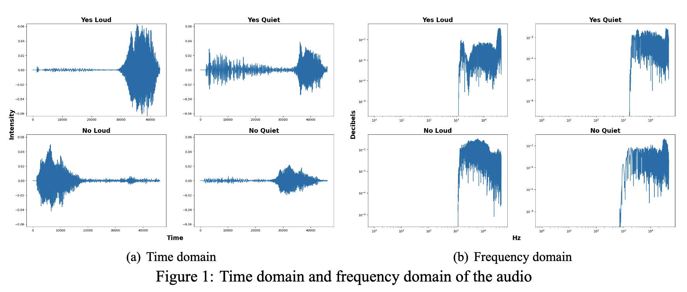
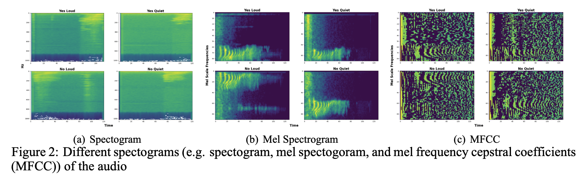
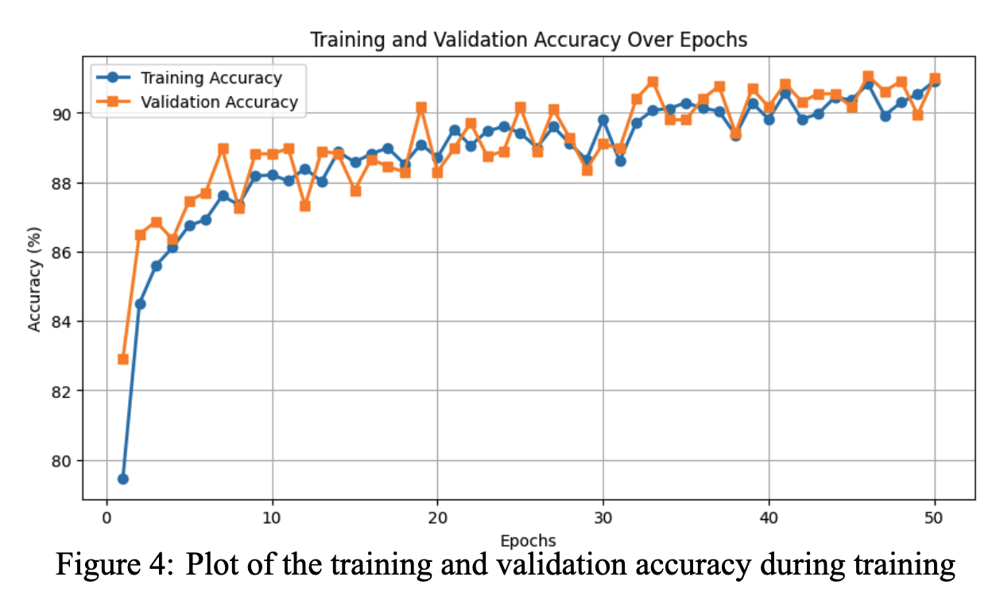
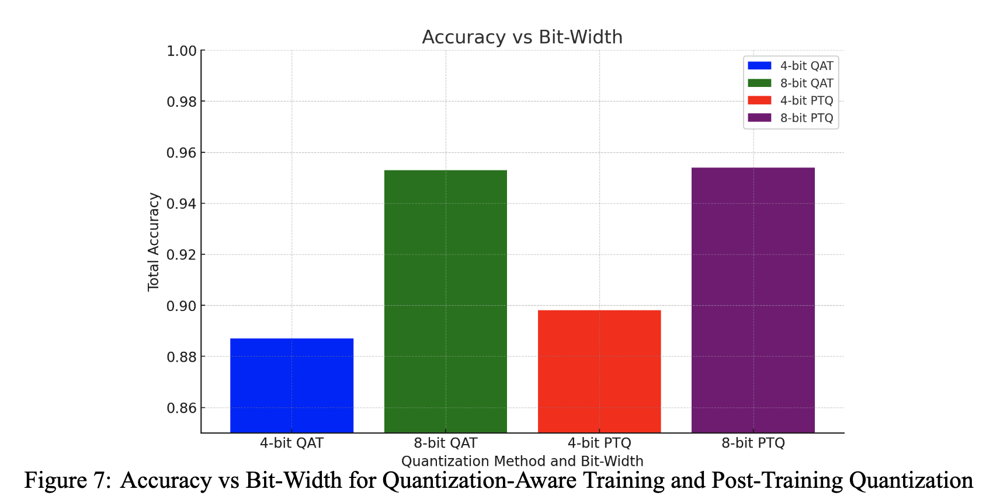
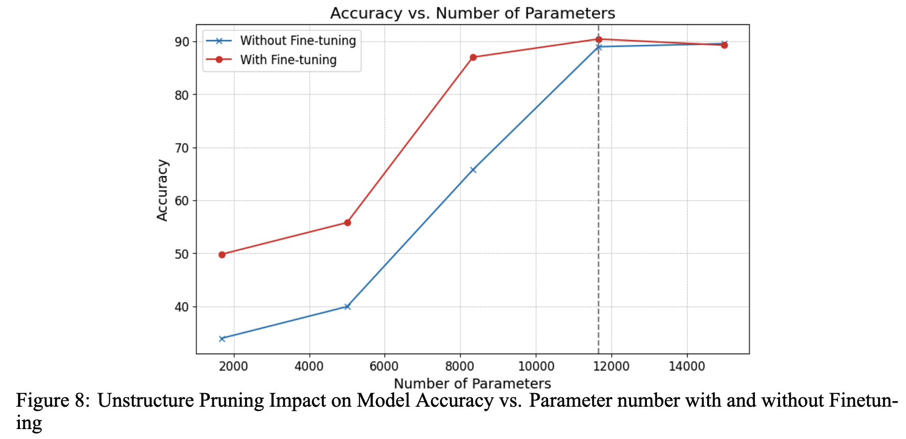
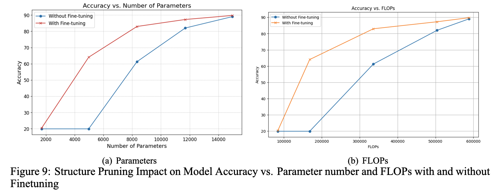
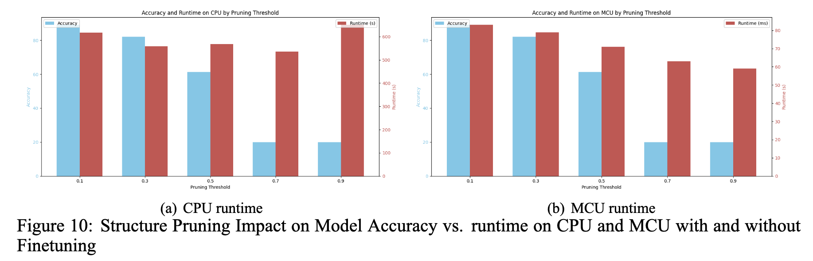

### Machine Learning Hardware and Systems

# Project: Keyword Spotting with MicroControllers

`"We cannot solve our problems with the same thinking we used when we created them.” -- Albert Einstein`

----

## Overview:
In this project, we trained and deployed an audio processing neural network on Arduino Tiny Machine Learning Kit. There are six sections in this project as outlined below. we implemented and investigated quantization and pruning in more depth.

1. [Preprocessing](#preprocessing)
2. [Model Size Estimation](#size)
3. [Training & Analysis](#training)
4. [Model Conversion](#conversion)
5. [Quantization](#quantization)
6. [Pruning](#pruning)

## Section 1: Preprocessing: Audio Recording and Visualization<a name="preprocessing" />
In this section, we recorded and visualized the sound bites. The audio is plotted in the time domain and frequency domain and as a spectrogram, a mel spectrogram, and lastly a mel frequency cepstral coefficients (MFCC) spectrogram as shown in Figure 1 and Figure 2. The result shows how signal transformations enable machine learning algorithms to better extract and utilize features.

  
  

## Section 2: Model Size Estimation <a name="size" /> 
MCUs have limited memory and processing power. Before deploying the model to the MCU we calculated its estimated RAM and flash usage and report the number of FLOPS of the model during a forward pass (for inference).

| Layer               | FLOPs      |
|---------------------|------------|
| Convolutional layer | 640,008    |
| Fully Connected layer | 32,004   |
| **Total**           | **672,024**|

Furthermore, we benchmarked the speed of the DNN on server-grade CPU and GPU to compare to the MCU. The inference runtime of the model (batch size = 1) is shown below.

| Environment           | Self CPU Time | Self CUDA Time |
|-----------------------|---------------|----------------|
| Intel Xeon CPU        | 14.761 ms     | -              |
| Tesla V100-SXM2-16GB  | -             | 28.000 us      |

## Section 3: Training & Analysis<a name="training" />
We train the model and report the accuracy after we have verified that the model could fit on our MCU. 

  

## Section 4: Model Conversion and Deployment<a name="conversion" />
Our model has been trained using the PyTorch framework, but the MCU only supports TFLite Micro. While converting to a TFLite model, we quantized the model to reduce its memory and computation. 

Profile running time and plot the breakdown between preprocessing, neural network, and post-processing on arduino and the result is shown below. The MCU has an average inference time of 86 ms, whereas the Intel Xeon CPU and Tesla V100 times are 14.761 ms and 28.000 us respectively. To facilitate a direct comparison, the GPU time is converted to milliseconds, resulting in 0.028 ms. These calculations indicate that the MCU is approximately 4.83 times slower than the Intel Xeon CPU and 3070.43 times slower than the Tesla V100 GPU during the inference phase of a deep neural network operation.

| Process Stage  | Min Time | Max Time | Avg Time |
|----------------|----------|----------|----------|
| Preprocessing  | 19 ms    | 23 ms    | 21 ms    |
| Inference      | 88 ms    | 88 ms    | 86 ms    |
| Post-processing| 0 ms     | 1 ms     | 0 ms     |

## Section 5: Quantization-Aware Training<a name="quantization"/>
We implemented a full precision (float 32) model which was quantized after training in Section 3. In this section, we use quantization-aware training (QAT) to try and improve model accuracy during training. The plot of accuracy vs. bit-width for **post-training quantization** and **quantization-aware training** between 2 and 8 bits are shown in Figure 7.

  

## Section 6: Pruning<a name="pruning" />
Pruning is another machine learning tactic that can help reduce model size and increase computational efficieny by removing unused parameters in neural networks. Pruning can remove groups of weights in **structured pruning** or individual weights in **unstructured pruning**. We implement both structured and unstructured pruning, and measure the impact on accuracy. 

1. For unstructured pruning:
The plot of the accuracy vs. number of parameters at different pruning thresholds with finetuning and without Fintuning is shown in Figure 8.

  

 3. For structured pruning (channel pruning) plot the following:
The plot of Accuracy vs. parameters/FLOPs at different pruning thresholds with and without finetuning is shown in Figure 9. The plot of Accuracy vs. runtime on CPU and MCU with and without Finetuning is shown in Figure 10.
        

  
  

